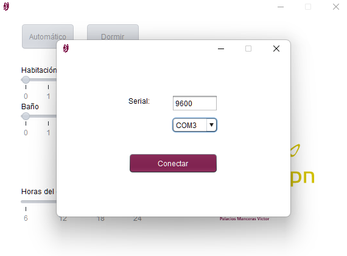

# Proyecto Simple Registradora

Proyecto escolar del instituto:
IPN - UPIICSA

Profesor: 
José Luis Lopez Goytia.

## Capturas



Video demostrativo:

https://drive.com

Manual de uso:

https://drive.com

## Tecnologías usadas 🛠️

Lenguaje de programación **Java**

Interfaz GUI **Java Swing**

Plataforma **Arduino**

### Instalación 🔧

Descargar el repositorio, ejecutar el Jar dentro de la carpeta Dist.
El código dentro de la carpeta arduino debe cargarse antes de usarlo.
```
$ cd C:\Users\%USERNAME%\Desktop
$ git clone https://github.com/LuisFlahan4051/ADP-project
$ cd ADP-project
```
## Autores ✒️
Secuencia: **1CM12**

**Arenas Vilchis Oscar Uriel.**

**Melendez Bustamante Luis Fernando.**
2020602568.
https://github.com/luisflahan4051

**Palacios Mancera Victor.**

## Licencia 📄
GNU GPL
